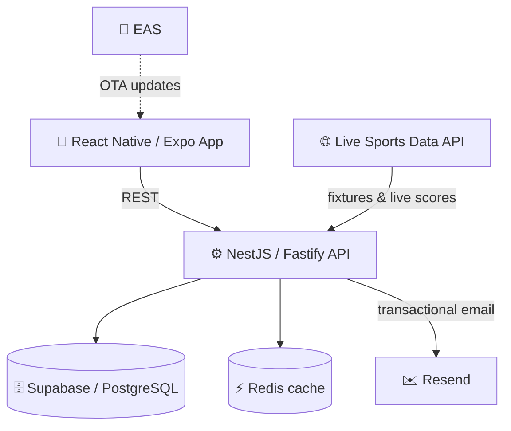

# ⚽ Tribuna

### The social network for football fans — rate every match, build your fan identity, climb the ranks.

**Letterboxd, but for football.** Log the matches you watch, rate them, debate them, build your *Fan DNA*, and level up from *Hincha* to *Vitalicio*.

 

  
  
  

---

## About

**Tribuna** is a mobile social platform where football fans log and rate the matches they watch, score individual players, follow leagues and teams in real time, and grow a gamified fan identity through XP, levels, and collectible badges. It's **live on the iOS App Store** with an active community posting reviews **every day — and growing**.

> 🛠️ **Designed, built, and shipped end-to-end by a single developer** — product, design, backend, frontend, and launch — using an AI-assisted development workflow. From a blank canvas to a production app in the App Store.

---

## ✨ Features

### 📝 Review and rate every match

Every match gets a full review flow: an overall star rating plus three sub-scores — **Calidad**, **Emoción**, and **Arbitraje** — and context for *how* you watched it (on TV or at the stadium). Want to go deeper? Rate the individual players straight from the lineup.

  
  

### 🌐 A living social feed

Reviews flow into a social timeline with **Following** and **Global** views, plus a dedicated **Debate** space. Each match has its own page aggregating community ratings and surfacing the **best and worst player** of the night.

  
  

### 🧬 Fan DNA, XP and badges

Activity feeds a six-dimension **Fan DNA** profile — *Analítico, Pasional, Crítico, Social, Estadista, Visionario* — visualized as a radar that captures the kind of supporter you are. An **XP and level system** (Hincha → Fanático → Socio → Abonado → Vitalicio) and **54 rarity-based collectible badges**, rendered as custom hexagonal SVG art, keep fans coming back.

  
  

### 🔭 Discover matches, teams and fans

A full discovery layer: ranked **best-rated and most popular matches**, real-time **scores and fixtures** across **50+ leagues**, and a **fan leaderboard** to find and follow other supporters.

  
  
  

---

## 🛠 Tech Stack

| Layer | Technologies |
|---|---|
| **Mobile** | React Native · Expo (SDK 54) · TypeScript |
| **Backend** | NestJS · Fastify · TypeScript · REST API |
| **Data** | Supabase (PostgreSQL) · Redis |
| **Infra & delivery** | Railway · Vercel · EAS (over-the-air updates) · Resend |
| **Integrations & auth** | Live sports data API (50+ leagues) · Supabase Auth with PKCE flow, email confirmation & deep linking |
| **Workflow** | AI-assisted development (Claude Code) · spec-driven, architecture-first |

---

## 🏗 Architecture

The app talks to a NestJS API that owns business logic and data. PostgreSQL (via Supabase) is the source of truth, with Redis caching hot paths. Live match data is ingested from an external sports API, transactional email runs through Resend, and updates ship to users over-the-air via EAS — no App Store review cycle required.

---

## 📈 At a glance

- 📱 **Live on the iOS App Store**, with a community posting reviews **daily and growing**
- ⚽ **9,000+** matches synced into production across **50+ leagues**
- 🏅 **54** collectible badges with custom hexagonal SVG art
- 🧬 **Fan DNA** profiling across six behavioral dimensions
- 🔐 Full email-confirmation auth flow (PKCE + deep linking)
- 🚀 Continuous delivery via over-the-air updates

---

## 🔗 Links

- 📱 **App Store:** https://apps.apple.com/app/id6773891274
- 🌐 **Web app:** https://app.apptribuna.com
- 🏠 **Landing:** https://apptribuna.com

---

## A note on the source

This is a **showcase repository**. Tribuna is a live commercial product, so its source code is kept private. This page documents what the product is, how it's built, and the role I played in building it. Happy to walk through the architecture or specific technical decisions in more detail on request.

---

Designed, built, and shipped by <b>Dante Iacopetti</b>.

